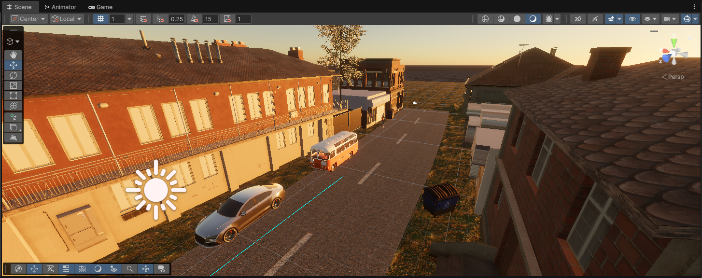
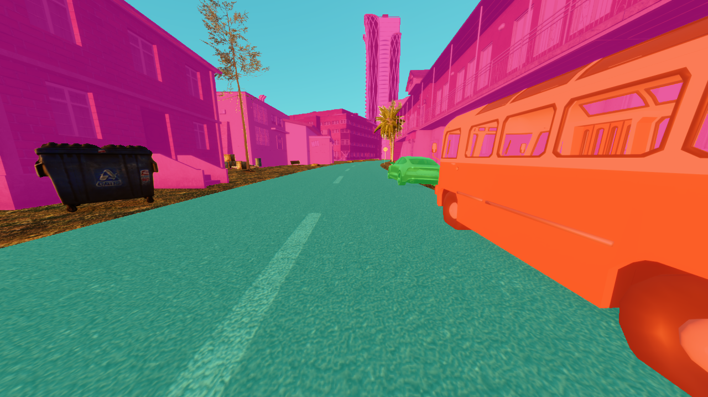
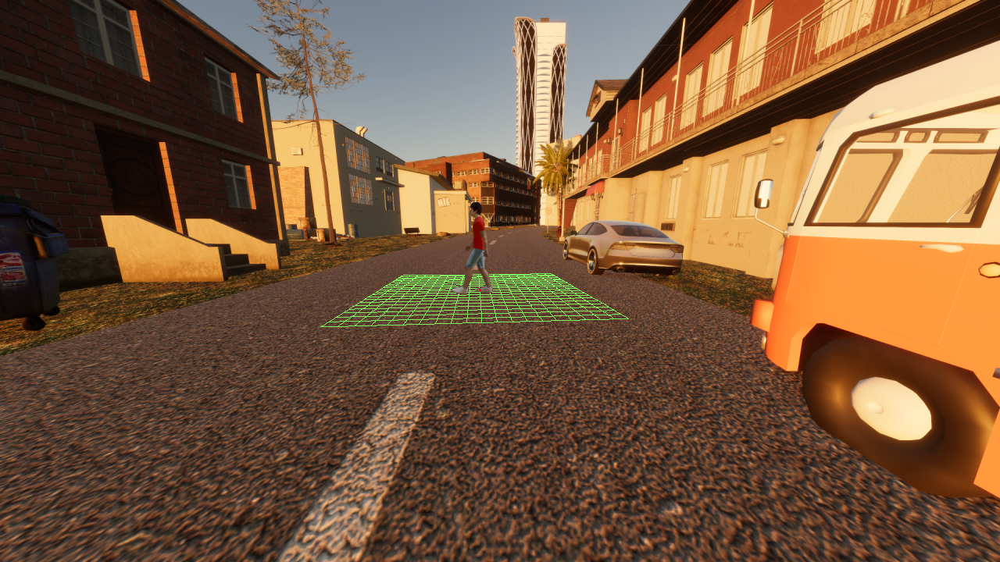
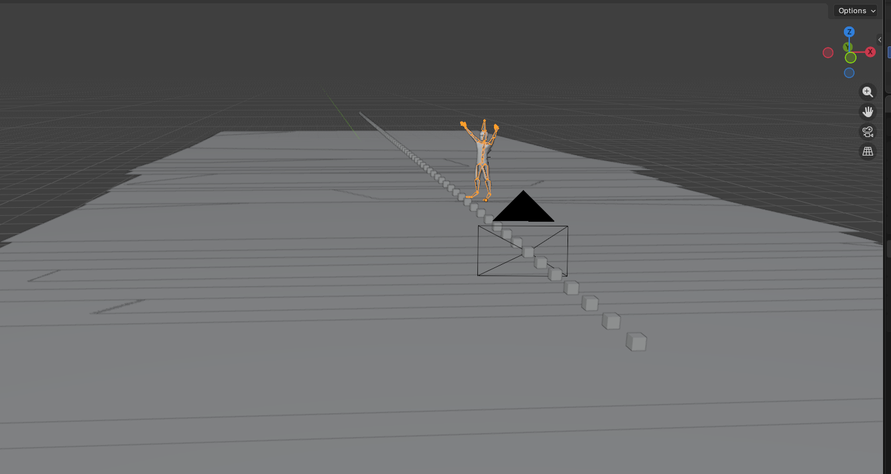
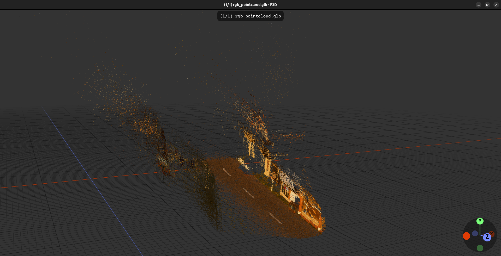

## Summary

PEMOIN is a computer-vision pipeline for inserting virtual pedestrians into monocular traffic-camera scenes in a geometrically plausible way. It estimates scene geometry from RGB video using depth estimation, visual odometry, semantic segmentation, road-plane reasoning, and lighting estimation, then renders and composites pedestrians into the scene with validation diagnostics.

This project was developed as my master's thesis and focuses on 3D scene understanding, synthetic data generation, and perception evaluation for traffic scenarios.


*Unity simulation source view used as an example input sequence for PEMOIN pipelines.*

## What It Does

- Estimates scene geometry from monocular RGB sequences.
- Standardizes depth, trajectory, semantics, camera pose, lighting, and road-plane outputs.
- Generates debug visualizations such as semantic masks, support-plane overlays, and point clouds.
- Inserts animated pedestrians using Blender-based rendering and compositing.
- Validates geometry, grounding, occlusion, lighting, and visual plausibility.

Representative standardized visualizations include semantic masks and road-support diagnostics:



*Semantic segmentation output for a processed frame.*



*Road support-plane overlay used for geometry and grounding diagnostics.*

## Start Here

- System architecture and runtime order: `docs/system-overview.md`
- Profile schema, current profiles, and settings: `docs/profile-reference.md`
- Standard output/resource contract: `docs/data-contract.md`
- Coordinate systems, comparison-frame canonicalization, and scale conventions: `docs/geometry-reference.md`
- Validation and quality metrics: `docs/validation.md`
- Integration notes for datasets/tools: `docs/integrations.md`
- Blender scene and Mixamo behavior: `docs/blender-scene.md`
- Non-canonical future ideas: `docs/design-roadmap.md`

## Repository Layout

- `src/pemoin/cli.py`: main CLI entrypoint
- `src/pemoin/runtime/`: runtime loop, orchestration, profile parsing, cache plumbing
- `src/pemoin/providers/`: provider base/factory plus adapters and batch providers
- `src/pemoin/data/contracts.py`: standardized resource contracts and `ResourceStore`
- `src/pemoin/coordinate_systems/`: conversions, comparison-frame canonicalization, and validation helpers
- `src/pemoin/visualization/`: visualization and video generation
- `config/profiles.json`: active profile catalog
- `docs/`: canonical repository documentation

## Installation

Python 3.10+ is required.

```bash
pip install uv
uv venv
source .venv/bin/activate
uv pip install .
uv pip install '.[offline,megasam,semantics,testing,dev]'
```

Blender scene export may run inside Blender's embedded Python, but PEMOIN's full host-side dependency set still belongs in the host Python environment. Pure Blender visualization imports now tolerate a missing `imageio`, and shared resize/compositing helpers now fall back to NumPy when Blender's Python lacks `cv2` and `PIL`. Host-side PNG processing and standard frame persistence still require `imageio`.
Current Blender raster runs also favor backend throughput for pipeline-internal artifacts: PEMOIN enables persistent render data when the Blender build exposes it, writes intermediate PNGs with fast compression settings, disables several costly EEVEE screen-space features for these internal renders by default, uses a fast subject-material policy that preserves base color/alpha/normal response while flattening lower-value secondary shading maps by default, binds dynamic subject-relative fill lights without per-frame location keyframes, skips raw-subject exposure processing entirely when the configured correction is a no-op, may render only a narrow class of disposable boundary-transition frames at a slightly reduced internal scale with milder fill-light and shadow reductions before upsampling them back to the baseline internal render shape, and may skip rasterizing frames whose grounding/visibility plan already marks the actor as off-camera while still materializing empty pedestrian/depth/shadow outputs for those frames.



*Blender scene visualization with inserted pedestrian geometry and scene-aligned lighting.*

## Run

```bash
python -m pemoin.cli \
  --profile carla_gt \
  --frames /path/to/video.mp4 \
  --output-root outputs
```

The CLI has no `run` subcommand. Use `pemoin ...` or `python -m pemoin.cli ...` directly.

Regular runs now use stage-aware console logging with a tree-style current-phase trace plus PEMOIN-owned progress bars for long-running loops. Default output shows major runtime transitions such as setup, frame loop, deferred providers, geometry stages, Blender, harmonisation, and video export without dumping per-frame noise. Blender subprocess frame-save chatter such as `render | Saved: ...frame_0001.png` stays suppressed, while PEMOIN still writes full Blender stdout/stderr under `outputs/<run>/standard/logs/`. Use `--verbose` for more detailed PEMOIN logs and substep chatter. Use `--quiet` to reduce console output to warnings and errors and suppress progress bars.

Each run now also writes a hierarchical runtime timing report to `outputs/<run>/standard/runtime/timeline.json`. That report records stage start/end times, durations, statuses, aggregate per-provider frame-loop timing, and cache outcomes such as hits and materialization so runtime bottlenecks can be inspected after the run. Current late-stage reuse covers Blender, harmonisation, and the harmonized ground-grid video, while batch semantics and deferred depth can now skip replay work when standardized outputs are materialized directly from cache.

## Current Profiles

Current entries in `config/profiles.json`:

- `unity_gt`
- `unity_dpvo`
- `carla_dpvo`
- `carla_gt`
- `nuscenes_gt`
- `nuscenes_dpvo`

The current NuScenes profiles use sweep-capable camera sampling through `NuScenesFrameProvider` with `sampling_mode=all_camera_frames`. `nuscenes_gt` currently requests `sampling_fps=30`, while `nuscenes_dpvo` may use a lower positive sampling rate tuned for the profile. Runtime resolves the actual emitted FPS from source timestamps.

Current lighting is profile-dependent. `carla_gt` uses `CarlaGTLightingProvider`, which converts exported CARLA weather and scene-light metadata into the standardized `standard/lighting/lighting.json` plus `standard/lighting/envmap.exr` package consumed by Blender. The Unity profiles now use `UnityGTLightingProvider`, which converts exported Unity `lighting_gt/` metadata into the same standardized package by publishing one analytic directional `SUN` light plus a reflection-probe-derived envmap and ambient-probe-driven ambient strength. `carla_dpvo` and the NuScenes profiles still bind `providers.lighting` to `DiffusionLightTurboLightingProvider`, which runs in env `diffusionlight-turbo` and publishes the same standardized contract from learned clip-level estimation. The EXR remains the canonical fused HDR envmap, while the JSON contract carries a versioned analytic light rig with direct-light and diffuse-fill decomposition diagnostics. Diffuse fills are now transport-aware subject lights: the provider publishes explicit wrap roles such as `wrap_key_fill`, `counter_wrap_fill`, and `sky_fill` as subject-relative fills with explicit placement targets, and current Blender consumption keeps `subject_root_dynamic` fills attached to the final grounded pedestrian root over time instead of treating them as fixed world-space emitters. The provider now uses a hybrid-adaptive wrap-geometry search and exposes `diffuse_softness_bias`, `fill_heavy_dark_side_target_ratio`, `fill_heavy_transport_gain`, and the `wrap_geometry_*` controls so diffuse-scene planning can demand materially stronger non-sun-side lift and softer direct-vs-diffuse balance before the rig is accepted. For those wrap fills, standardized `strength` is transport strength, not raw Blender point-light power; Blender realizes that strength with role-aware point-light calibration controlled by `runtime.settings.blender_scene.lighting.wrap_subject_fill`, including explicit counter-side and sky-softness biases so final tuning stays in profile config instead of code. Lighting reuse is split into reusable DiffusionLight-Turbo inference artifacts plus the final standardized lighting package, so planner-only lighting changes can rebuild the final rig without rerunning DLT. The current DLT path is offline-first for Hugging Face-backed model loads: required weights must already exist in the local cache or be provided as local directories unless online fetch is explicitly enabled. If a configured lighting provider cannot produce plausible lighting, it fails before publishing standardized lighting outputs.

Current subject appearance matching is also scene-aware rather than background-only. Raw subject exposure calibration now behaves as a conservative fine-trim stage rather than a full relighting pass: it uses robust luminance anchors, prefers nearby real scene pedestrians when semantics detect them, falls back to the local background ring when they do not, and skips the correction entirely when gain dispersion or predicted residuals indicate the calibration would be unstable. Harmonisation can use those same pedestrian references to soften saturation and contrast without copying another pedestrian's literal clothing or skin hue.

Current Blender pedestrian insertion also treats Mixamo assets as a local package, not just two FBX paths. PEMOIN now resolves a canonical Mixamo asset root next to the character FBX by default, relinks imported material textures against that local package when they are file-backed, accepts embedded FBX textures when Blender reports them as packed images, normalizes the imported Mixamo material graph into a stable Principled interpretation, writes `mixamo_asset_diagnostics.json`, and fails fast only when a required image is neither packed nor resolvable from the asset root. That prevents silently shipping dark untextured pedestrians while still supporting raw Mixamo FBX downloads that carry embedded image payloads. Blender-enabled runs now also emit a reusable single-clip animated FBX under `artifacts/blender/fbx_exports/character_root_motion.fbx` together with an export manifest and a run-root convenience copy `character_root_motion.fbx`. That export is origin-centered, preserves clip root motion, prefers embedded textures via Blender's FBX exporter, and is a late-stage artifact rather than a standardized cross-stage resource.
Known path-backed profile inputs now also fail fast during profile loading. Current checks cover Mixamo FBX paths, optional Mixamo asset roots, the harmonizer checkpoint path, the DiffusionLight-Turbo repo root, CARLA label maps, and adapter checkpoint/config paths when those fields are present in `config/profiles.json`.
Imported character assets are now also treated as metric-authoritative. PEMOIN assumes users supply correctly metric-sized Mixamo/character assets, preserves their imported scale as-is, and never rescales characters in Blender scene export.
Current Mixamo heading resolution no longer depends on animation locomotion. PEMOIN now resolves heading from measured imported-rig body-facing instead of a fixed FBX forward guess, so idle and other non-locomotion clips can still be inserted while moving clips keep body-facing aligned with `pedestrian_heading_deg`. The imported animation always remains the authoritative pose/timing source, while actor world translation is controlled separately through `runtime.settings.blender_scene.pedestrian_motion_policy`. Current default behavior is `auto`, but `auto` now resolves from the animation asset path category instead of inferred clip motion: clips under `assets/mixamo/animations/idle/` stay fixed at the resolved spawn point, while clips under `assets/mixamo/animations/moving/` use animation-root-motion world translation. `pedestrian_trajectory_t` only chooses the initial placement sample on the standardized trajectory; once spawned, moving clips travel in scene world according to the resolved animation-root-motion heading, which can intentionally differ from the local trajectory tangent when `pedestrian_heading_deg` is nonzero. That root-motion extraction now tracks unwrapped authored cycle progress explicitly across repeated walk loops and fails fast on backward seam regressions instead of clipping them into a repaired path after the fact, while Blender now stabilizes the pelvis in world space and converts the corrected transform back into pose space so loop seams cannot survive inside rig-native hips channels. Blender also validates sampled baked body-facing against the resolved world heading and aborts on parity failures instead of silently rendering a pedestrian that walks one way while visibly facing another. Camera trajectory now selects only the insertion spawn/heading basis for moving clips; it no longer drives the pedestrian root path unless the explicit legacy `camera_trajectory_relative` mode is requested. Paths outside those directories fail fast instead of guessing. Blender render visibility is also fail-fast now: when grounding/visibility expect the actor on-screen but the rendered PNG sequence contains zero visible alpha, PEMOIN aborts instead of silently continuing with empty pedestrian renders.

Current DPVO-backed profiles (`unity_dpvo`, `carla_dpvo`, `nuscenes_dpvo`) now use the PyTorch native CUDA allocator by default instead of forcing expandable segments. DPVO writes allocator-aware diagnostics to `raw/dpvo/dpvo_memory_diagnostics.json` and fails fast on detected allocator instability instead of silently retrying with degraded settings.
Current `unity_dpvo` runs also use a privileged Unity GT gravity prior for estimated comparison-frame up alignment while still keeping DPVO as the trajectory source; this behaves like an IMU-style up prior, not like GT trajectory replacement.

Current low-FPS validation is adaptive rather than fully fixed-threshold. When `runtime.settings.validation_policy.enabled=true`, PEMOIN keeps the current validator thresholds at `sampling_fps >= 10`, gradually relaxes selected geometry-quality thresholds below `10 FPS`, emits loud degraded warnings with threshold details, and continues unless a harder limit or an integrity failure is crossed. Structural failures such as missing artifacts, invalid schemas, invalid matrices, or zero viable anchors still fail fast.

## Output Rule

Later pipeline stages must consume standardized resources from `outputs/<run>/standard/`.

`outputs/<run>/raw/` is reserved for provider-native outputs, caches, and diagnostics and must not be treated as a cross-stage contract.

Late-stage Blender and harmonisation frame trees live under `outputs/<run>/artifacts/`. The run root keeps only convenience outputs such as `scene.blend`, `character_root_motion.fbx`, and the copied final video `output.mp4`.

Point-cloud debug GLBs produced from aligned geometry live under `outputs/<run>/artifacts/geometry/point_cloud/` and are also copied to the run root as `rgb_pointcloud.glb` and `semantic_pointcloud.glb`.



*Dense RGB point cloud exported from aligned geometry for scene inspection.*

See `docs/data-contract.md` for the full resource layout.

## Environment Overrides

- `PEMOIN_ACTIVE_PROFILE`
- `PEMOIN_PROFILES_CONFIG`

## Testing

```bash
uv pip install '.[testing]'
pytest
```
