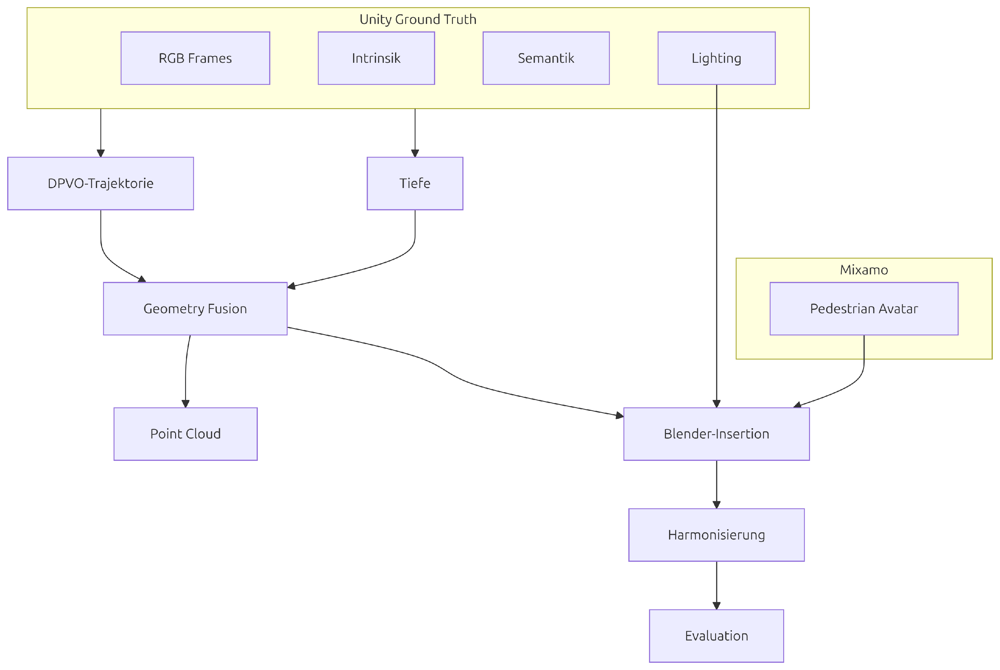
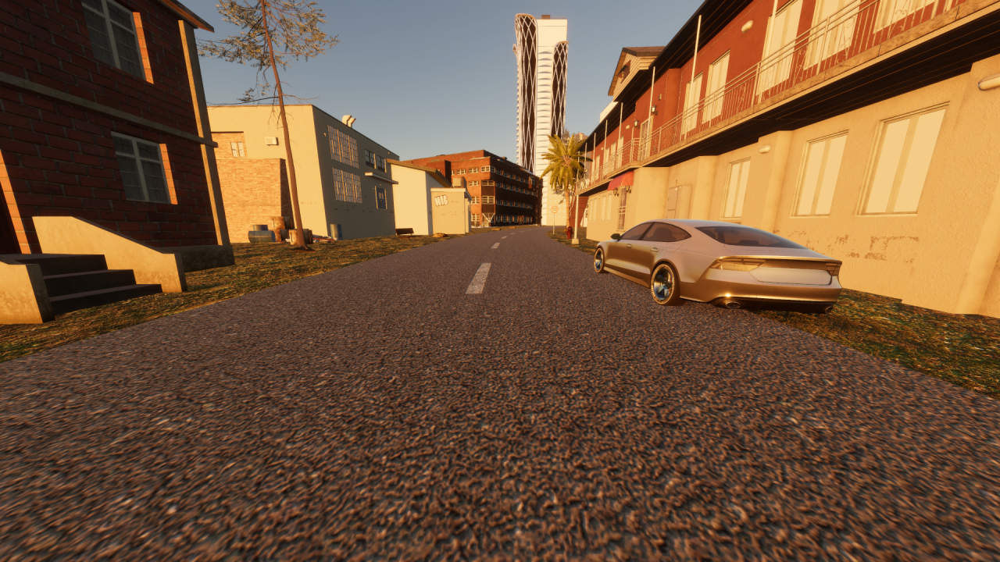
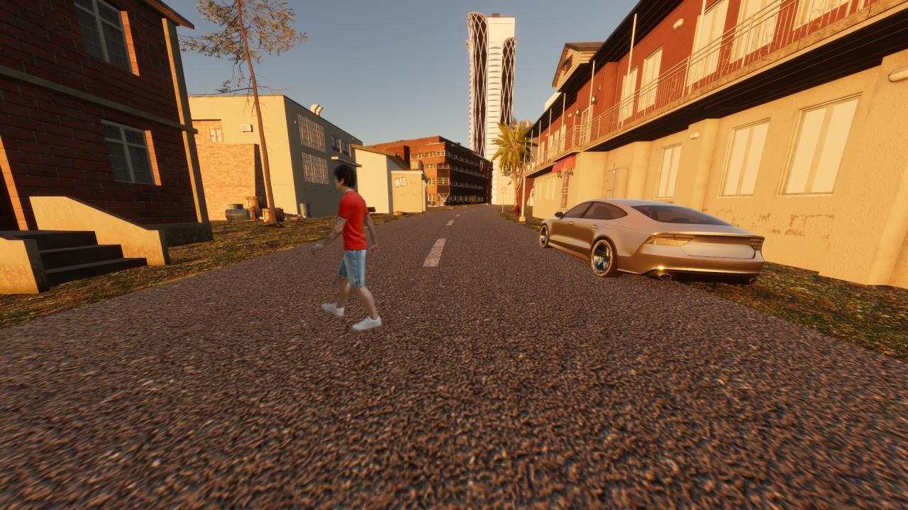

# PEMOIN

PEMOIN turns monocular RGB sequences into standardized geometry, lighting, semantics, and scene-composition outputs for driving-scene analysis and pedestrian insertion.
This project was developed as part of my master's thesis on realistic virtual pedestrian insertion in camera-based traffic scenes.



## Highlights

- Produces standardized scene resources: intrinsics, depth, trajectory, semantics, road plane, lighting, diagnostics, point clouds, Blender artifacts, and final videos.
- Combines provider-based geometry estimation, metric consistency fusion, road-support fitting, lighting estimation, Blender rendering, and optional pedestrian harmonisation.
- Handles the core challenge of bringing depth, trajectory, road support, camera height, lighting, and inserted actors into one consistent metric scene from monocular or exported sequence data.
- Built with Python 3.10+, NumPy, PyTorch-backed adapters, Blender, optional MegaSAM/PanSt3R/DPVO/DepthAnything-style providers, and dataset integrations for Unity, CARLA, Virtual KITTI 2, and NuScenes.


## Example Output

| Input frame | PEMOIN output |
| --- | --- |
|  |  |

*Before-and-after example showing an original video frame and the corresponding PEMOIN output with an inserted pedestrian.*


*Unity simulation source view used as an example input sequence for PEMOIN pipelines.*


*Semantic segmentation output for a processed frame.*


*Road support-plane overlay used for geometry and grounding diagnostics.*


*Blender scene visualization with inserted pedestrian geometry and scene-aligned lighting.*


*Dense RGB point cloud exported from aligned geometry for scene inspection.*

## Method

PEMOIN runs configurable provider pipelines over videos, image directories, Unity exports, CARLA exports, Virtual KITTI 2, and NuScenes samples. Providers publish standardized resources into `outputs/<run>/standard/`, while tool-native artifacts, caches, and diagnostics remain under `outputs/<run>/raw/` or `outputs/<run>/artifacts/`.

The active geometry path enforces one metric-consistency contract across corrected depth, trajectory, road support, and camera height. DPVO trajectory shape is preserved with at most one global translation scale change, depth absorbs remaining corrections through constrained per-frame affine rectification, and the run fails fast when signals cannot be aligned into a common metric scene.

Later stages consume the standardized resources to export dense RGB point-cloud debug GLBs, build Blender scenes, render inserted pedestrians, compose occlusion-aware overlays, apply optional harmonisation, and produce final videos. Cross-run cache reuse can skip expensive lighting, geometry, point-cloud, Blender, harmonisation, and video stages when compatible artifacts already exist.

More detailed references:

- `docs/system-overview.md`: architecture and runtime order
- `docs/profile-reference.md`: profiles and settings
- `docs/data-contract.md`: standardized resource contract
- `docs/geometry-reference.md`: coordinate systems and scale conventions
- `docs/validation.md`: validation and quality metrics
- `docs/integrations.md`: dataset and tool notes
- `docs/blender-scene.md`: Blender scene and Mixamo behavior

## Setup

Python 3.10+ is required.

```bash
pip install uv
uv venv
source .venv/bin/activate
uv pip install .
uv pip install '.[offline,megasam,semantics,testing,dev]'
```

Blender scene export may run inside Blender's embedded Python, but PEMOIN's full host-side dependency set belongs in the host Python environment. Some profiles also require local model checkpoints, adapter repositories, CARLA label maps, Mixamo assets, or harmonizer checkpoints configured in `config/profiles.json`.

## Usage

Run PEMOIN directly through the module or installed console entrypoint. The CLI has no `run` subcommand.

```bash
python -m pemoin.cli \
  --profile carla_gt \
  --frames /path/to/video.mp4 \
  --output-root outputs
```

Equivalent installed-entrypoint form:

```bash
pemoin \
  --profile carla_gt \
  --frames /path/to/video.mp4 \
  --output-root outputs
```

Current profiles in `config/profiles.json` include:

- `unity_gt`
- `unity_dpvo`
- `carla_dpvo`
- `carla_gt`
- `nuscenes_gt`
- `nuscenes_dpvo`

Useful environment overrides:

- `PEMOIN_ACTIVE_PROFILE`
- `PEMOIN_PROFILES_CONFIG`

Run tests with:

```bash
uv pip install '.[testing]'
pytest
```
Large datasets, model checkpoints, and licensed character assets are not included in this repository.
## Results

Each run writes standardized resources under `outputs/<run>/standard/`, provider-native outputs and diagnostics under `outputs/<run>/raw/`, late-stage Blender and harmonisation artifacts under `outputs/<run>/artifacts/`, and convenience outputs such as `scene.blend`, `character_root_motion.fbx`, `rgb_pointcloud.glb`, `semantic_pointcloud.glb`, and `output.mp4` at the run root.
Validation and timing artifacts include geometry quality checks, trajectory and road metrics, standardized logs, and a hierarchical runtime report at `outputs/<run>/standard/runtime/timeline.json`. Representative outputs are semantic masks, road-support overlays, aligned dense point clouds, Blender scene renders, harmonized pedestrian overlays, and final composed videos.
The thesis evaluation included reconstruction and insertion diagnostics as well as a descriptive user study with 18 participants.

## Limitations

- DPVO-backed profiles depend on GPU stability, local environment configuration, and allocator diagnostics.
- DiffusionLight-Turbo lighting is offline-first by default; required weights must already exist locally unless online fetch is explicitly enabled.
- Blender pedestrian insertion expects metric-authoritative Mixamo or character assets and fails fast when required textures or visibility checks are invalid.
- Low-FPS inputs use adaptive validation thresholds, but structural failures such as missing artifacts, invalid schemas, invalid matrices, or zero viable anchors still fail fast.
- Later stages must consume standardized resources from `outputs/<run>/standard/`; `outputs/<run>/raw/` is reserved for provider-native artifacts and is not a cross-stage contract.
